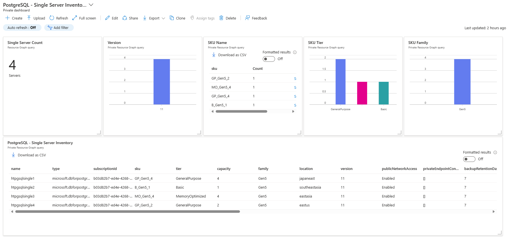
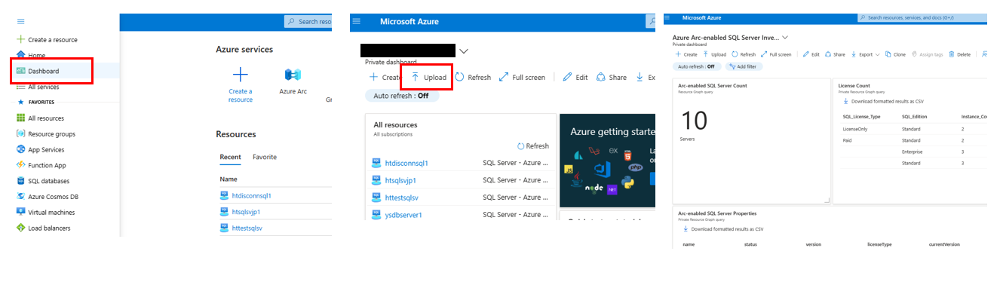

# azure-postgresql-singleserver-discovery
This dashboard discovers Azure Database for PostgreSQL - Single server in your Azure subscription. This will help you identify your Azure Database for PostgreSQL - Single server that need to be migrated to Flexible server.

It includes:

- Number of Azure Database for PostgreSQL - Single Servers
- PostgreSQL Version
- SKU Name
- SKU Tier
- SKU Family
- Detailed server list

## How to install the dashboard

1. Download "azure-postgresql-single-server-discovery.json" file from this repository
2. Go to https://portal.azure.com
3. Ensure that you can access to the subscription that has Azure Database for PostgreSQL - Single Server
4. Go to dashboard, click "Upload", select "azure-postgresql-single-server-discovery.json"

